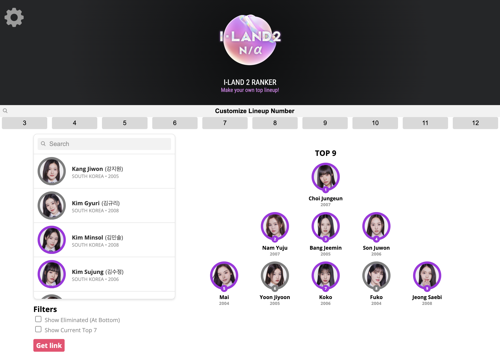

A personal ranker that allows you to rank and sort your own top lineup for Mnet's idol survival show I-LAND 2, the sequel to I-LAND. It currently has functionality for adding and removing trainees on the table through click, sorting them on the ranking itself through drag & drop, and activating filters that show which contestants have been eliminated or currently hold a Top 7 (tba) position. It is also possible to save a link of your current ranking to revisit it as the episodes progress.

<b>Notes</b>
* This was forked from [iland2 top7 ranker](https://github.com/il2ranker/il2ranker.github.io) which was forked from the amazing [produce48 ranker](https://github.com/produce48/produce48.github.io).
* This adds custom lineup numbers so you can make custom lineups.

<b>Updates</b>

04/29: Ranker + customization has been made
04/30: Ground + I-Land ranks have been added

